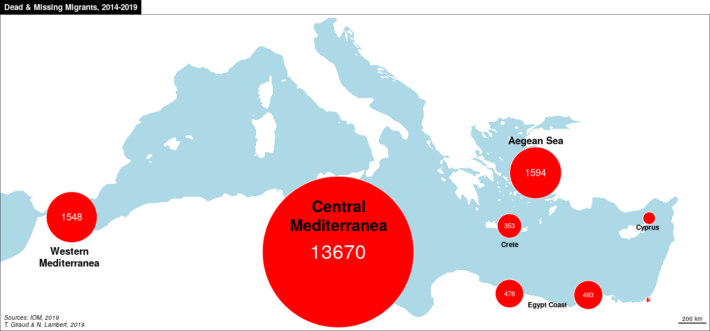
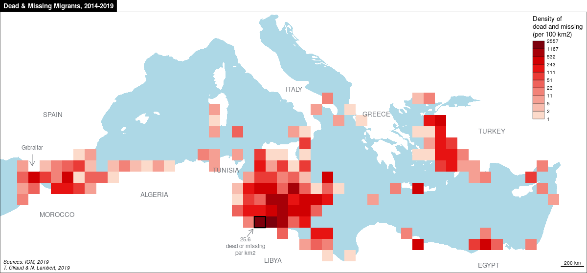
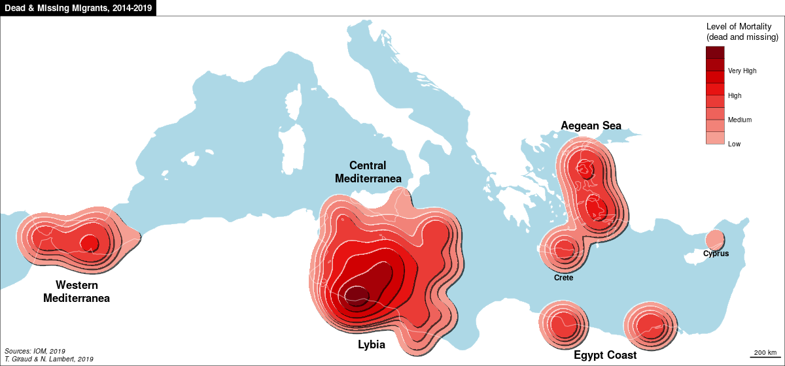
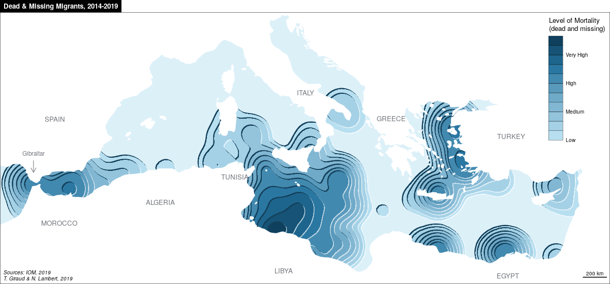
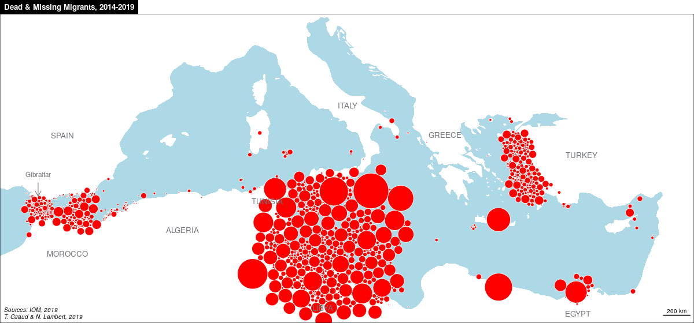

<link rel="stylesheet" type="text/css" media="all" href="css/style.css" />


**In this document, we propose new cartographic representations illustrating the deaths of migrants at the borders of the European Union over the period 2015-2018, based on data provided by IOM. The maps and source codes are available below.**

##  Data import, cleaning & Tyding

```{r eval=TRUE, echo=TRUE}
library(rnaturalearth)
library(sf)
library(cartography)
```

Data available on the IOM website: https://missingmigrants.iom.int/downloads

```{r , eval=TRUE, echo=TRUE}
mdm <- read.csv("data/mdm2014.csv", stringsAsFactors = F)
mdm <- rbind(mdm,read.csv("data/mdm2015.csv", stringsAsFactors = F))
mdm <- rbind(mdm,read.csv("data/mdm2016.csv", stringsAsFactors = F))
mdm <- rbind(mdm,read.csv("data/mdm2017.csv", stringsAsFactors = F))
mdm <- rbind(mdm,read.csv("data/mdm2018.csv", stringsAsFactors = F))
```

Chart by year

```{r , eval=TRUE, echo=TRUE}
par(mar=c(5,5,4,1.5))
med <- mdm[mdm$Region == "Mediterranean",]
med <- aggregate(med$Total.Dead.and.Missing,list(med$Reported.Year), sum, simplify = TRUE )
colnames(med) <- c("year","nb")
total <- round(sum(med$nb),-2)
med[med$year==2018,"year"] <- "2018*"
barplot(med$nb, main=paste0(total," Dead & Missing Migrants in the\nMediterranean, 2014-2018"), xlab="(*) from 1 January to 3 October 2018", ylab="Number of persons", names.arg=med$year,
          border="#991313",col=c("red","red","red","red","#ffbaba"))

```

Calculation of the number of deaths or missing persons per day

```{r , eval=TRUE, echo=TRUE}

total <- sum(med$nb)
nbdays <- 365 + 365 + 366 + 365 + 276
nbperday <- round(total/nbdays,2)
nbperday
```

Conversion to sf & selection of the Mediterranean Area

```{r , eval=TRUE, echo=TRUE}
latlon <- matrix(as.numeric(unlist(strsplit(mdm$Location.Coordinates, 
                                            split = ", "))), ncol = 2, byrow = T)
colnames(latlon) <- c("lat", 'lon')
mdm <- cbind(mdm, latlon)
mdm <- st_as_sf(mdm, coords = c("lon", "lat"), crs = 4326)
mdm <- mdm[mdm$Region%in%"Mediterranean",]
mdm <- st_transform(mdm, 3395)
```

Geometries for layout

```{r , eval=TRUE, echo=TRUE}
ctry <- st_read("data/ne_50m_admin_0_countries.shp")
ctry <- st_transform(ctry, 3395)

ocean <- st_read(dsn = "data/ne_50m_ocean.shp")
ocean <- st_transform(ocean, 3395 )
bbocean <- st_bbox(c(xmin = -982800, xmax = 4070000, 
                     ymin = 3450000, ymax = 5710000), 
                   crs = st_crs(ocean))

ocean <- st_crop(ocean, bbocean)
ocean <- st_cast(ocean, to = "POLYGON")
ocean <- ocean[10, ]
p2 <- rbind(c(3030089,4992571), 
            c(3030089,5927043), 
            c(4155959,5927043),
            c(4155959,4992571), 
            c(3030089,4992571))
pol <-st_polygon(list(p2))
pol <- st_sfc(pol, crs = st_crs(ocean))
ocean <- st_difference(ocean, pol)
```

Set the size of the maps.

```{r , eval=TRUE, echo=TRUE}
sizes <- getFigDim(x = ocean, width = 800,mar = c(0,0,1.2,0), res = 100)
sizes <- c(1200, 560)
xlim = c(-570000, 3900000)
ylim = c(3500000, 5650000)
```

Layout template

```{r , eval=TRUE, echo=TRUE}
lay <- function(title = ""){
  # CARTOGRAPHIC LAYOUT
  layoutLayer(frame = TRUE, tabtitle = TRUE, scale = 200, north = F, 
              author = "T. Giraud & N. Lambert, 2018", title = title,
              source = "Sources: IOM, 2018")
  p <- c(-648841, 4467573)
  text(p[1], 4507864, "Gibraltar", adj = c(0.5,0),  col="#70747a",cex=0.7)
  arrows(p[1], p[2], p[1], p[2]-100000, code = 2, length = 0.1,  col="#70747a")
  text(1667817, 5026113, "ITALY", adj = c(0.5,0), col="#70747a",cex=0.8)
  text(-467143.1, 4800787, "SPAIN", adj = c(0.5,0), col="#70747a",cex=0.8)
  text(3419723, 4654326, "TURKEY", adj = c(0.5,0), col="#70747a",cex=0.8)
  text(3391557, 3460100, "EGYPT", adj = c(0.5,0), col="#70747a",cex=0.8)
  text(1065071, 4305071, "TUNISIA", adj = c(0.5,0), col="#70747a",cex=0.8)
  text(-427711.1, 3910751, "MOROCCO", adj = c(0.5,0), col="#70747a",cex=0.8)
  text(434159.2, 4091012, "ALGERIA", adj = c(0.5,0), col="#70747a",cex=0.8)
  text( 1481923, 3505165, "LIBYA", adj = c(0.5,0), col="#70747a",cex=0.8)
  text( 2400125, 4806420, "GREECE", adj = c(0.5,0), col="#70747a",cex=0.8)
}
```

# Vision 1

This first map represents the number of dead and missing migrants in the Mediterranean with a symbology by proportional symbols.

```{r , eval=TRUE, echo=TRUE}
png("output/rawPlot.png", width = sizes[1], height = sizes[2], res = 100)
par(mar = c(0,0,1.2,0))
plot(ocean$geometry,col = "lightblue", border = NA,
     xlim = xlim, ylim = ylim)
propSymbolsLayer(mdm, var  = "Total.Dead.and.Missing", 
                 col = "red", fixmax = 750,inches = 0.3,
                 border = "white", lwd = .8, legend.pos = "n")
legendCirclesSymbols(pos = "topright", 
                     title.txt = "Number of\ndead and missing", 
                     var = c(750,300,100,10), inches = .3, col = "red", 
                     style = "e")
lay("Dead & Missing Migrants, 2014-2018")
dev.off()
```

</img>


# Vision 2

This second map proposes an aggregation of the different events by zones through a cluster analysis basend on x,y coordinates.  

```{r , eval=TRUE, echo=TRUE}
# spatiale aggregation
mdm$x <- st_coordinates(mdm)[,1]
mdm$y <- st_coordinates(mdm)[,2]
# CAH aggregation 
nbclass<-8
height<- NULL
#height<- 1000000000000
method<-"single" #ward.D, ward.D2, complete, single
data <- as.data.frame(mdm)
data <- data[data$Total.Dead.and.Missing>0,]
data$id <- data$Web.ID
xy <- data.frame(id=data$id,x=data$x,y=data$y)
rownames(xy) <- xy$id
d <- dist(xy, method = "euclidean", diag = FALSE, upper = FALSE, p = 2)
cah <- hclust(d, method = method, members = NULL)
# dev.off()
# plot(cah, labels = NULL, hang = 0, axes = TRUE, frame.plot = FALSE,
#      ann = TRUE, main = "Cluster Dendrogram", sub = NULL, xlab = NULL, ylab = "Height")
classif <- cutree(cah, h = height, k = nbclass)
classif <- as.data.frame(classif)
classif <- data.frame(id=row.names(classif),class=classif$classif)
data <- data.frame(data, classif[match(data[,"id"],classif[,"id"]),])
nb <- length(unique(classif$class))
datax <- by(data,data$class, function(x) weighted.mean(x$x, x$Total.Dead.and.Missing),simplify = TRUE)
datay <- by(data,data$class, function(x) weighted.mean(x$y, x$Total.Dead.and.Missing),simplify = TRUE)
data2 <- aggregate(data$Total.Dead.and.Missing, by = list(id = data$class), sum, simplify = TRUE)
datax<-as.vector(datax)
datay<-as.vector(datay)
oim_cah <- data.frame(id=data2$id,x=datax,y=datay,death_aggr=data2$x)
oim_cah_sf <- st_as_sf(oim_cah, coords = c("x", "y"), crs = st_crs(mdm))

png("output/CAH.png", width = sizes[1], height = sizes[2], res = 100)
par(mar = c(0,0,1.2,0))
plot(ocean$geometry,col = "lightblue", border = NA,
     xlim = xlim, ylim = ylim)
propSymbolsLayer(x = oim_cah_sf, var = "death_aggr", 
                 symbols = "circle", col =  "red",fixmax = 750,
                 legend.pos = "n", border = "white",
                 legend.title.txt = "death_aggr",
                 legend.style = "c",inches = 0.3)
labelLayer(x = oim_cah_sf[-5,], txt = "death_aggr", cex = c(2, 1, 1, 0.7, 0.7, 0.7, 0.7), 
           col = "white")
labtext <- data.frame(lab = c("Central\nMediterranea", "Western\nMediterranea", 
                              "Aegean Sea", "Egypt Coast", "Cyprus", "Crete"), 
                      x = c(1544634.2, -426723.9, 2988275.7, 3073046.2, 3809219.6, 2796077.6), 
                      y = c(4258000, 4008000, 4802000, 3600000, 4167000, 4050000)) 
text(x = labtext$x, labtext$y, labels =labtext$lab, cex =  c(1.6, 1, 1, 0.7, 0.7, 0.7), font = 2)

layoutLayer(frame = TRUE, tabtitle = TRUE, scale = 200, north = F, 
            author = "T. Giraud & N. Lambert, 2018", 
            title = "Dead & Missing Migrants, 2014-2018",
            source = "Sources: IOM, 2018")
dev.off()
```
</img>

# Vision 3

This third map represents the number of dead and missing migrants in the Mediterranean by aggregating into a 100km² resolution regular grid.

```{r , eval=TRUE, echo=TRUE}
# Create a regular grid (adm bbox)
grid <- st_make_grid(x = ocean, cellsize = 100000, what = "polygons")
. <- st_intersects(grid, ocean)
grid <- grid[sapply(X = ., FUN = length)>0]
grid <- st_sf(idgrid = 1:length(grid), grid)
. <- st_intersection(mdm, grid)
griddf <- aggregate(.$Total.Dead.and.Missing, by = list(idgrid = .$idgrid), sum)
grid <- merge(grid, griddf, by = "idgrid", all.x = TRUE)

png("output/gridPlot.png", width = sizes[1], height = sizes[2], res = 100)
par(mar = c(0,0,1.2,0))
bks <- getBreaks(grid[grid$x>0,"x", drop = T], nclass = 10, method = "geom")
cols <- carto.pal("red.pal", 10)
plot(ocean$geometry,col = "lightblue", border = NA,
     xlim = xlim, ylim = ylim)
choroLayer(x = grid[grid$x>0,], var = "x", legend.pos = NA,
           border = NA, add=T, colNA = NA, 
           col =cols, breaks = bks) 
legendChoro(pos = "topright", title.txt = "Density of\ndead and missing\n(per 100 km2)",
            breaks = bks, col = cols, cex = 0.6, values.rnd = 0, nodata = F)
plot(grid[order(grid$x, decreasing = T),"geometry"][1,], add=T, lwd = 2)
p <- c(-648841, 4467573)
text(1240000, 3735000, "24.5\ndead or missing\nper km2", adj = c(0.5 ,1),  col="#70747a",cex=0.7)
arrows(1254749, 3737898, 1307223, 3804683, code = 2, length = 0.1,  col="#70747a")
lay("Dead & Missing Migrants, 2014-2018")
dev.off()
```

</img>

# Vision 4

This fourth map provides a smoothed representation of the geographical phenomenon by calculating its potential (stewart method).

```{r , eval=TRUE, echo=TRUE}
library("SpatialPosition")
res <- 25000
span <- 75000
unk <- CreateGrid(w = as(ocean, 'Spatial'), res = res)
stew <- stewart(knownpts = as(mdm, 'Spatial'), varname = "Total.Dead.and.Missing", 
        typefct = "exponential", beta = 2, unknownpts = unk, span = span)
ras <- rasterStewart(stew)

# red liss
contour <- rasterToContourPoly(r = ras, 
                               breaks = c(0,25,50,100,175,250,500,
                                          1000,2000,3000,4000))
iso_pop <- st_as_sf(contour[c(-9, -10),])

# order iso surfaces
iso_pop <- iso_pop[order(iso_pop$center),]
# color palette à la viridis
pal <-carto.pal("red.pal", 10)[3:10]
png("output/smooth1.png", width = sizes[1], height = sizes[2], res = 100)
par(mar = c(0,0,1.2,0))
plot(ocean$geometry,col = "lightblue", border = NA,
     xlim = xlim, ylim = ylim)
for(i in 1:nrow(iso_pop)){
  p <- st_geometry(iso_pop[i,])
  # plot light contour polygons with a Nort-West shift
  plot(p + c(-5000, 5000), add=T, border = "#ffffff90",col = "#ffffff90")
  # plot dark contour polygons with a South-East shift
  plot(p + c(7000, -7000),  col = "#00000099", add=T, border = "#00000099")
  # plot colored contour polygons in place
  plot(p, col = pal[i], border = "NA", add=T)
}
plot(ocean$geometry,col = NA, border = "#ffffff80", lwd = 1,
     xlim = xlim, ylim = ylim, add=T)
labtext <- data.frame(lab = c("Central\nMediterranea", "Western\nMediterranea",
                              "Aegean Sea", "Egypt Coast", "Cyprus", "Crete", "Lybia"), 
                      x = c(1504634.2, -426723.9, 2978275.7, 
                            3073046.2, 3809219.6, 2796077.6, 1528228), 
                      y = c(4703372, 3908000, 5000000, 3480000, 
                            4155000, 4000000,3551342 )) 
text(x = labtext$x, labtext$y, labels =labtext$lab, 
     cex = c(1, 1, 1, 1, 0.7, 0.7), font = 2)
bks <- c("Low", "", "Medium", "", "High", "","Very High", "", "")
legendChoro(pos = "topright", breaks = bks, 
            title.txt = "Level of Mortality\n(dead and missing)",
            col = pal, nodata = F, values.rnd = -1, cex = 0.7)
layoutLayer(frame = TRUE, tabtitle = TRUE, scale = 200, north = F, 
            author = "T. Giraud & N. Lambert, 2018", 
            title ="Dead & Missing Migrants, 2014-2018",
            source = "Sources: IOM, 2018")
dev.off()
```

</img>


# Vision 5

This fifth map repeats the previous one by inverting the values. A hole forms in the sea to remind us of drownings.

```{r , eval=TRUE, echo=TRUE}
# Blue liss
contour <- rasterToContourPoly(r = ras, 
                               breaks = c(0,5,10,25,50,100,175,250,500,
                                          1000,2000,3000,4000))
iso_pop <- st_as_sf(contour)
iso_pop <- iso_pop[-nrow(iso_pop),]
# order iso surfaces
iso_pop <- iso_pop[order(iso_pop$center),]
# color palette à la viridis

carto.pal("blue.pal", 20)[18]
pal <-carto.pal("blue.pal", nrow(iso_pop))
png("output/smooth2.png", width = sizes[1], height = sizes[2], res = 100)
par(mar = c(0,0,1.2,0))
plot(ocean$geometry,col = "#DCF0F8", border = NA,
     xlim = xlim, ylim = ylim)
for(i in 1:nrow(iso_pop)){
  p <- st_geometry(iso_pop[i,])
  # plot light contour polygons with a Nort-West shift
  plot(p - c(-5000, 5000), add=T, border = "#ffffff90",col = "#ffffff90")
  # plot dark contour polygons with a South-East shift
  plot(p - c(7000, -7000),  col = "#14405A", add=T, border = "#14405A")
  # plot colored contour polygons in place
  plot(p, col = pal[i], border = "NA", add=T)
}
plot(ctry$geometry, col = "#ffffff", border = "#ffffff", lwd = 1,
     xlim = xlim, ylim = ylim, add=T)
bks <- c("Low", "","", "Medium", "","", "High", "","","Very High", "", "")
legendChoro(pos = "topright", breaks = bks, 
            title.txt = "Level of Mortality\n(dead and missing)",
            col = pal, nodata = F, values.rnd = -1, cex = 0.7)
lay("Dead & Missing Migrants, 2014-2018")
dev.off()
```

</img>

# Vision 6

This sixth map solves the problem of overlaying seen on map 1, by using the dorling cartogram method.

```{r , eval=TRUE, echo=TRUE}
library(cartogram)
w <- 1 - (mdm$y / max(mdm$y))
mdmdor <- cartogram_dorling(x = st_jitter(mdm), 
                            weight = "Total.Dead.and.Missing",k = .8)

png("output/dorling.png", width = sizes[1], height = sizes[2], res = 100)
par(mar = c(0,0,1.2,0))
plot(ocean$geometry,col = "lightblue", border = NA,
     xlim = xlim, ylim = ylim)
plot(mdmdor$geometry, add=T,  border = "white", col = "red", lwd = .8)
lay("Dead & Missing Migrants, 2014-2018")
dev.off()
```

</img>
